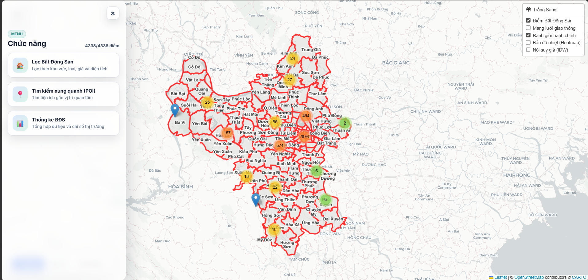
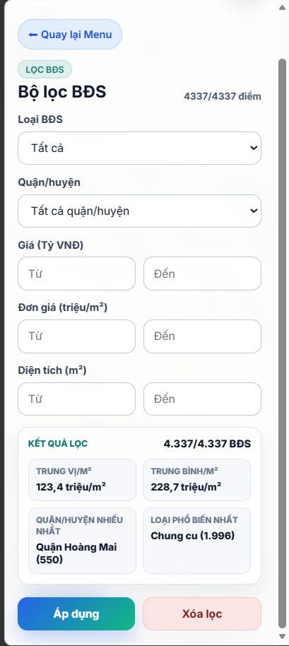
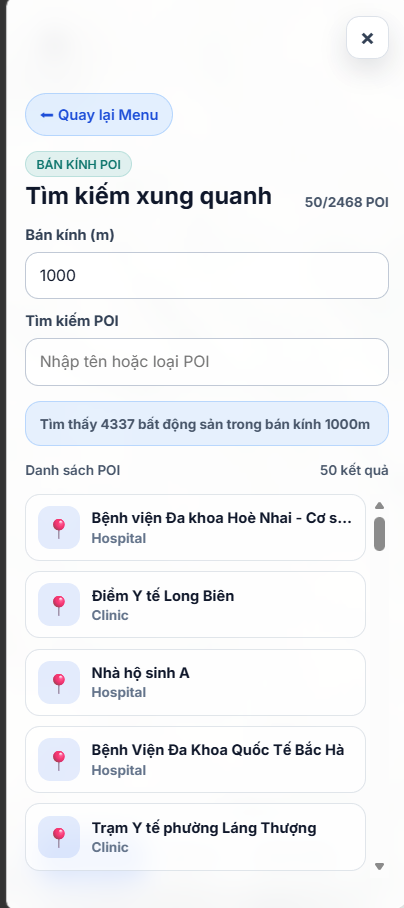
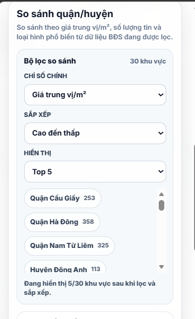
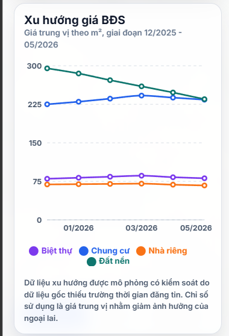

# WebGIS BĐS Hà Nội

Ứng dụng WebGIS trong phân tích phân bố và xu hướng giá bất động sản thành phố Hà Nội.

Project được định vị là công cụ phân tích, hay "Radar thị trường BĐS", nhằm hỗ trợ quan sát phân bố không gian, mặt bằng giá, khu vực nóng và xu hướng giá theo thời gian. Đây không phải website rao vặt, đăng tin hoặc giao dịch bất động sản.

## Phạm vi đồ án

Project tập trung vào bài toán WebGIS: bất động sản phân bố ở đâu, mặt bằng giá khoảng bao nhiêu, khu vực nào có mật độ/giá nổi bật và xu hướng giá thay đổi thế nào theo thời gian.

Ứng dụng không xử lý nghiệp vụ rao vặt, đăng tin, môi giới, đặt lịch xem nhà, thanh toán hoặc giao dịch BĐS. Popup và dashboard chỉ phục vụ phân tích, trực quan hóa và rà soát dữ liệu.

## Chức năng chính

- Hiển thị bản đồ Leaflet toàn màn hình, trung tâm khu vực Hà Nội.
- Hiển thị điểm bất động sản bằng marker cluster.
- Bật/tắt các layer GeoServer: điểm BĐS, ranh giới hành chính, giao thông, Heatmap và IDW.
- Đổi nền bản đồ: CARTO light, CARTO dark, OpenStreetMap.
- Lọc BĐS theo loại, quận/huyện, khoảng giá, đơn giá/m² và diện tích.
- Tìm kiếm POI, chọn POI làm tâm và lọc BĐS theo bán kính.
- Xem popup thông tin BĐS phục vụ phân tích: mã dữ liệu, loại BĐS, khu vực, giá, diện tích, đơn giá.
- Dashboard thống kê tổng quan: tổng số BĐS, giá trung vị/m², giá trung bình/m², diện tích trung vị, loại phổ biến, khu vực nổi bật.
- So sánh giá theo quận/huyện với các chỉ số như giá trung vị/m², giá trung bình/m², số lượng tin và diện tích trung vị.
- Biểu đồ xu hướng giá BĐS theo tháng bằng dữ liệu trend mock có kiểm soát.

## Trạng thái chức năng hiện tại

| Module | Trạng thái |
| --- | --- |
| Marker cluster BĐS | Đã hiển thị điểm BĐS trên bản đồ bằng `react-leaflet-cluster` |
| Bộ lọc BĐS | Đã lọc theo loại, quận/huyện, giá, đơn giá/m² và diện tích |
| POI radius search | Đã tìm POI, vẽ bán kính và lọc BĐS quanh POI |
| WMS overlay | Đã bật/tắt ranh giới, giao thông, Heatmap và IDW |
| `StatsDashboard` | Đã thống kê tổng quan theo danh sách BĐS đang được lọc |
| `DistrictComparison` | Đã so sánh chỉ số giá/số lượng/diện tích theo quận/huyện |
| `TrendChart` | Đã vẽ xu hướng giá theo tháng từ layer trend mock WFS |

## Ảnh demo

Các ảnh demo đặt trong `docs/images` để GitHub hiển thị trực tiếp trong README.

### 1. Tổng quan bản đồ WebGIS



### 2. Bộ lọc và dashboard thống kê



### 3. Tìm kiếm POI theo bán kính



### 4. So sánh giá theo quận/huyện



### 5. Biểu đồ xu hướng giá BĐS



## Công nghệ sử dụng

| Nhóm | Công nghệ |
| --- | --- |
| Frontend | React, Vite |
| Bản đồ | Leaflet, react-leaflet |
| Marker cluster | react-leaflet-cluster |
| Biểu đồ | Recharts |
| Dịch vụ bản đồ | GeoServer WMS/WFS |
| Cơ sở dữ liệu không gian | PostgreSQL/PostGIS |
| Biên tập/xử lý GIS | QGIS |
| Dữ liệu phân tích không gian | Vector GIS, raster Heatmap, raster IDW |

## Cấu trúc thư mục

```text
D:\Doan-webgis-bds-hanoi
├── data/
├── database/
├── docs/images/
├── frontend/
├── README.md
└── SETUP.md
```

Các thư mục quan trọng:

- `frontend/src/components`: component giao diện, bản đồ, sidebar, dashboard, so sánh quận/huyện và biểu đồ xu hướng.
- `frontend/src/config`: cấu hình nền bản đồ, endpoint GeoServer và tên layer.
- `frontend/src/services`: hàm gọi WFS/WMS từ GeoServer.
- `frontend/src/utils`: helper xử lý dữ liệu BĐS, thống kê, filter, format và geometry.
- `frontend/src/styles`: style giao diện theo hướng Glassmorphism.
- `data`: dữ liệu GIS, raster Heatmap/IDW và file QGIS phục vụ biên tập/publish.

## Điều kiện môi trường

- Node.js khuyến nghị Node 20 LTS hoặc mới hơn.
- npm.
- GeoServer chạy local tại `http://localhost:8080`.
- GeoServer workspace: `doan_webgis`.
- PostgreSQL/PostGIS đã có dữ liệu BĐS Hà Nội, trong đó bảng BĐS chính là `public.bds_hanoi_real_data`.
- Bảng trend mock: `public.bds_price_trend_mock`.
- View trend publish qua GeoServer: `public.v_bds_price_trend_mock_geom`.
- Các endpoint WFS/WMS của GeoServer cần cho phép CORS để frontend Vite gọi từ browser.

Frontend phụ thuộc GeoServer local tại:

- Workspace base URL: `http://localhost:8080/geoserver/doan_webgis`
- WMS: `http://localhost:8080/geoserver/doan_webgis/wms`
- WFS/OWS: `http://localhost:8080/geoserver/doan_webgis/ows`

## Layer GeoServer cần publish

| Layer | Mục đích |
| --- | --- |
| `doan_webgis:bds_hanoi_real_data` | Dữ liệu điểm BĐS chính, dùng cho marker, filter và WMS GetFeatureInfo |
| `doan_webgis:hanoi_pois` | Dữ liệu POI dùng cho tìm kiếm và lọc BĐS theo bán kính |
| `doan_webgis:hanoi_roads` | Layer giao thông |
| `doan_webgis:ranh_gioi_hanoi` | Ranh giới hành chính Hà Nội |
| `doan_webgis:Heatmap_BDS_HaNoi` | Raster Heatmap mật độ/độ nóng BĐS |
| `doan_webgis:IDW_BDS_HaNoi` | Raster nội suy IDW giá BĐS |
| `doan_webgis:v_bds_price_trend_mock_geom` | Layer WFS cung cấp dữ liệu xu hướng giá mock cho biểu đồ |

## Hướng dẫn chạy project

Trước khi chạy đầy đủ chức năng phân tích bản đồ, cần bảo đảm GeoServer đang chạy tại `http://localhost:8080`, workspace `doan_webgis` đã được tạo và PostgreSQL/PostGIS đã có dữ liệu BĐS Hà Nội tương ứng với các layer bên trên.

Cài dependency và chạy frontend:

```bash
cd frontend
npm install
npm run dev
```

Frontend Vite mặc định chạy tại:

```text
http://localhost:5173
```

Frontend gọi dữ liệu bản đồ, marker, POI, Heatmap, IDW và biểu đồ xu hướng qua GeoServer local:

```text
http://localhost:8080/geoserver/doan_webgis
```

Nếu chỉ chạy frontend mà chưa cấu hình GeoServer/PostGIS, giao diện vẫn có thể mở tại `http://localhost:5173`, nhưng dữ liệu bản đồ, marker BĐS, POI, Heatmap, IDW hoặc biểu đồ xu hướng giá có thể không hiển thị đầy đủ.

Build production:

```bash
npm run build
```

Preview bản build:

```bash
npm run preview
```

Kiểm tra lint:

```bash
npm run lint
```

## Hướng dẫn setup chi tiết

`README.md` là tài liệu tổng quan và hướng dẫn chạy nhanh frontend. Để dựng đầy đủ môi trường GeoServer/PostGIS, dữ liệu GIS/raster và các layer cần publish đúng tên, xem [SETUP.md](./SETUP.md).

## Dữ liệu xu hướng giá mock

Dữ liệu gốc `public.bds_hanoi_real_data` thiếu trường thời gian đăng tin thật, nên project không trình bày trực tiếp dữ liệu này như chuỗi thời gian thị trường thật.

Để phục vụ chức năng phân tích xu hướng trong đồ án, nhóm tạo dữ liệu xu hướng mô phỏng có kiểm soát. Dữ liệu trend được tổng hợp trong bảng `public.bds_price_trend_mock`, theo tháng và loại hình BĐS.

Chỉ số chính dùng trong biểu đồ là giá trung vị/m² nhằm giảm ảnh hưởng của outlier. Ngoài ra bảng trend có thể chứa các chỉ số bổ trợ như số lượng tin và giá trung bình/m².

GeoServer publish dữ liệu trend qua view `public.v_bds_price_trend_mock_geom`. View này có geometry giả chỉ để GeoServer có thể publish WFS/GeoJSON. Frontend chỉ dùng phần `properties` của layer `doan_webgis:v_bds_price_trend_mock_geom` để vẽ `TrendChart`; geometry của layer trend không được dùng để phân tích không gian.

Khi trình bày hoặc báo cáo, cần ghi rõ dữ liệu trend là dữ liệu mock phục vụ demo/phân tích chức năng, không phải dữ liệu thị trường thật.

## Ghi chú dữ liệu và giới hạn

- Thư mục `data/` có thể bị ignore hoặc không đi kèm đầy đủ khi clone repo nếu dữ liệu không được đính kèm riêng.
- GeoServer và PostgreSQL/PostGIS cần được cấu hình thủ công theo workspace, datastore, layer, raster store và style tương ứng.
- Repo hiện chưa có migration SQL hoặc script setup GeoServer tự động đầy đủ.
- Frontend hiện load dữ liệu WFS về client rồi filter phía browser. Cách này phù hợp cho demo và dataset hiện tại, nhưng cần tối ưu bằng filter server-side, WFS CQL hoặc API trung gian nếu mở rộng dữ liệu lớn.
- Heatmap/IDW phụ thuộc vào raster store trên GeoServer và đường dẫn file raster trong môi trường local.

## Kiểm thử và kiểm tra

Các lệnh nên chạy sau khi sửa frontend:

```bash
cd frontend
npm run lint
npm run build
```

Nếu `npm run build` xuất hiện warning của Vite về chunk lớn hơn 500 kB nhưng lệnh vẫn kết thúc thành công, build vẫn được xem là pass. Warning này nên được xử lý sau bằng tối ưu bundle hoặc tách chunk nếu project mở rộng.
